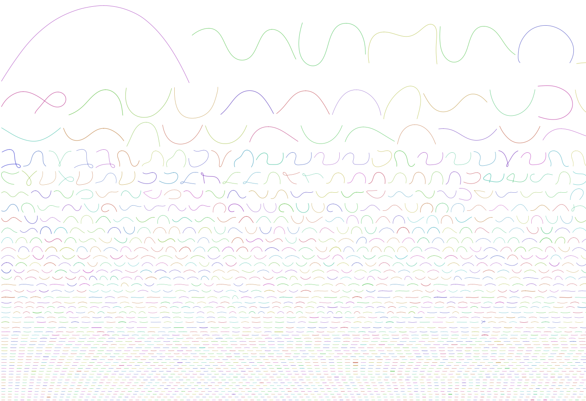

Please submit your generated figure and explain in your own words what you can see (keep it short).

In the picture there are the different assembled contiq sizes and possible loops in it

    What is your N50 value? Why is this value relevant?
    How many contigs are assembled?
    What is the total length of the contigs?

N50: 2963 It shows the median of contiq length. So you can see how good the assembly data is

contiq number 57414
total length: 145675865