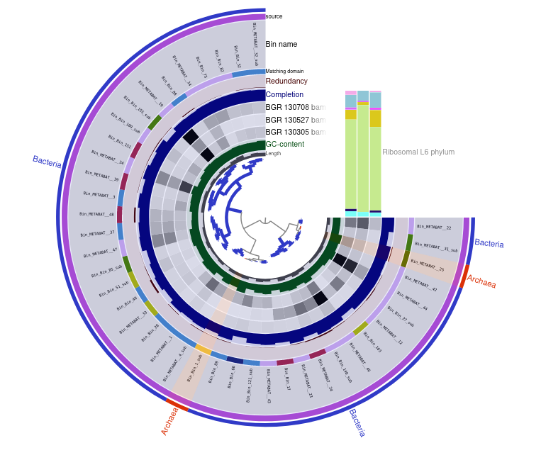
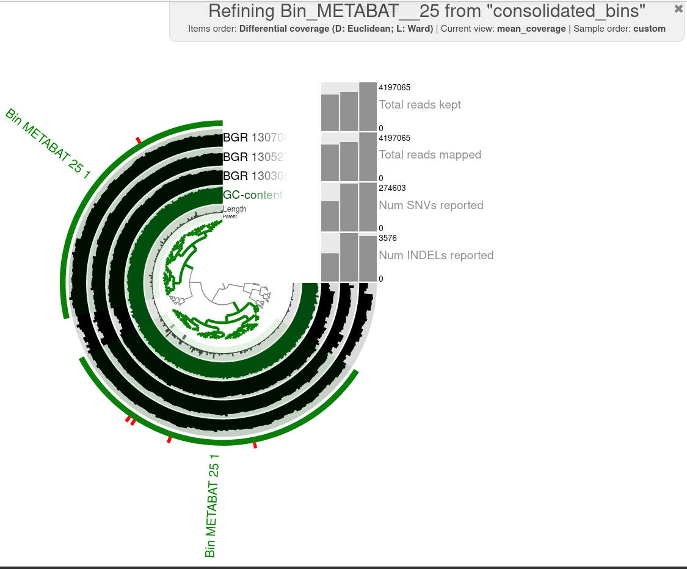

# Day 5

## Tutorial 

I built this tree 



Which binning strategy gives you the best quality for the Archaea
bins??

Looking at the completeness and redundancy, the METABAT archaea bin has 
97.37 and 5.26, respectively and 
How many Archaea bins do you get that are of High Quality? How many Archaea bins do you get that are of High Quality?

to summarize the data so far: 

```
anvi-summarize -c contigs.db -p /work_beegfs/sunam229/Day5/5_anvio_profiles/merged_profiles/PROFILE.db -C consolidated_bins -o 1_summary --just-do-it
```
Archaea names:
Bin_METABAT__25
 	Bin_Bin_1_sub

    cp /work_beegfs/sunam229/Day5/1_summary/bin_by_bin/Bin_METABAT__25/*.fa /work_beegfs/sunam229/Day5/ARCHAEA_BIN_REFINEMENT/o-it

activate GUNC for chimeric detection 

```
conda activate /home/sunam226/.conda/envs/gunc
```

checking for chimeric sequences
```
cd /work_beegfs/sunam229/Day5/5_anvio_profiles/ARCHAEA_BIN_REFINEMENT/

mkdir GUNC

for i in *.fa; do gunc run -i "$i" -r /home/sunam226/Databases/gunc_db_progenomes2.1.dmnd --out_dir GUNC --threads 10 --detailed_output; done
```
### Do you get Archaea bins that are chimeric?

A chimeric MAG contains contigs of different species

The METABAT data is chimeric on kingdom, phylum and class level, the CONCOT data is not chimeric

bin editing using the anvio interface

```
anvi-refine -c /work_beegfs/sunam229/Day5/contigs.sb -C consolidated_bins -p /work_beegfs/sunam229/Day5/5_anvio_profiles/merged_profiles/PROFILE.db --bin-id Bin_METABAT__25
```



### Does the quality of your Archaea improve?

completeness before: 97,4 %
completeness after: 93,4 %

the redundancy stays the same

But nethertheless the qualitiy should have improved because paths with a bad coverage and not matching GC content were thrown out

### How abundant are the archaea bins in the 3 samples? (relative abundance)?

METABAT: 1.76 	1.14 	0.58
CONCOT: 0.96 	0.00 	0.40


taxonomic annotation

```
anvi-run-scg-taxonomy -c contigs.db -T 20 -P 2
```
### Did you get a species assignment to the Archaea bins previously identified?

yes: 

Methanosarcina flavescens
Methanoculleus sp012797575


### Does the HIGH-QUALITY assignment of the bin need revision?