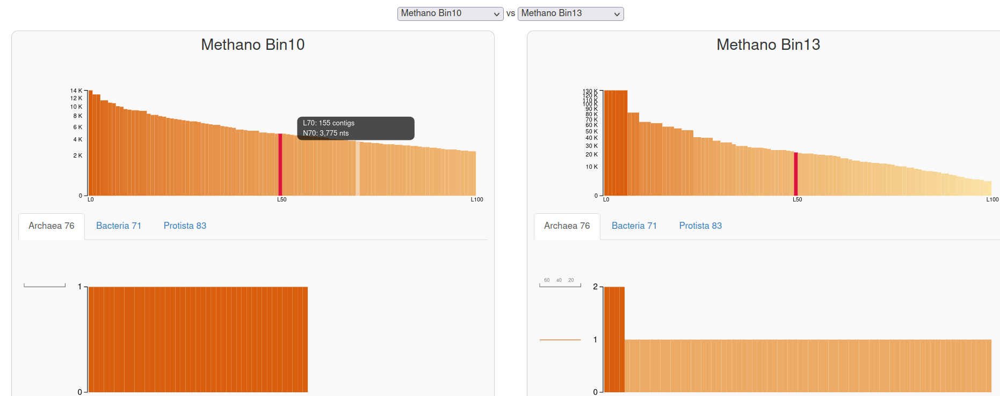
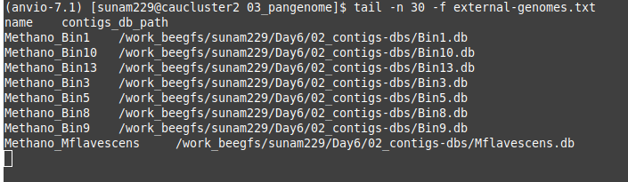
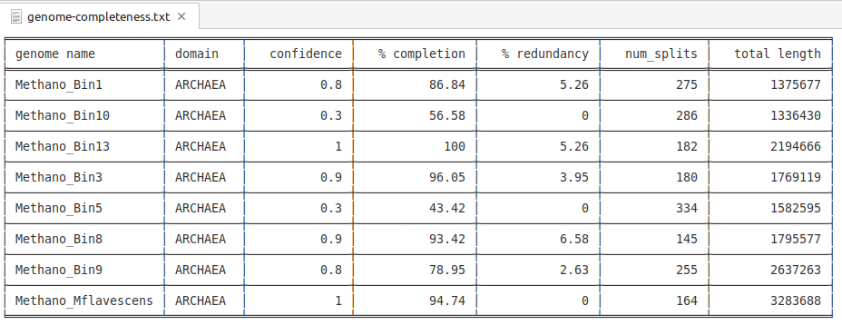
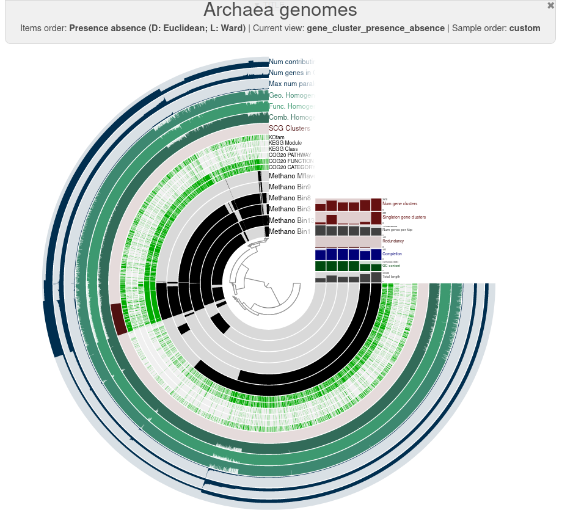
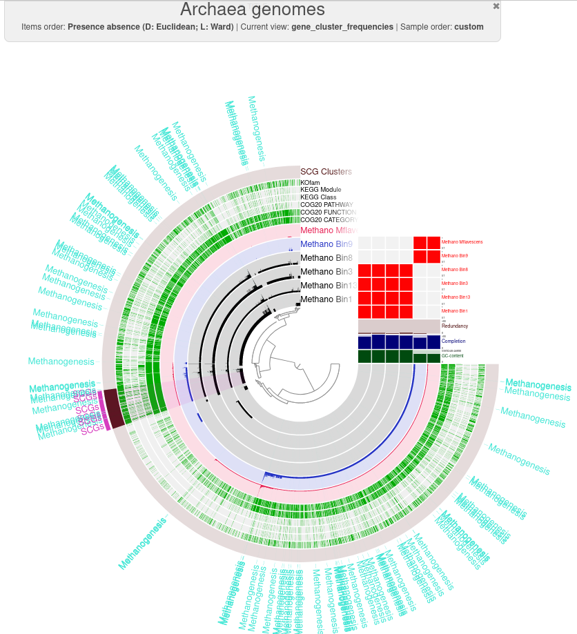
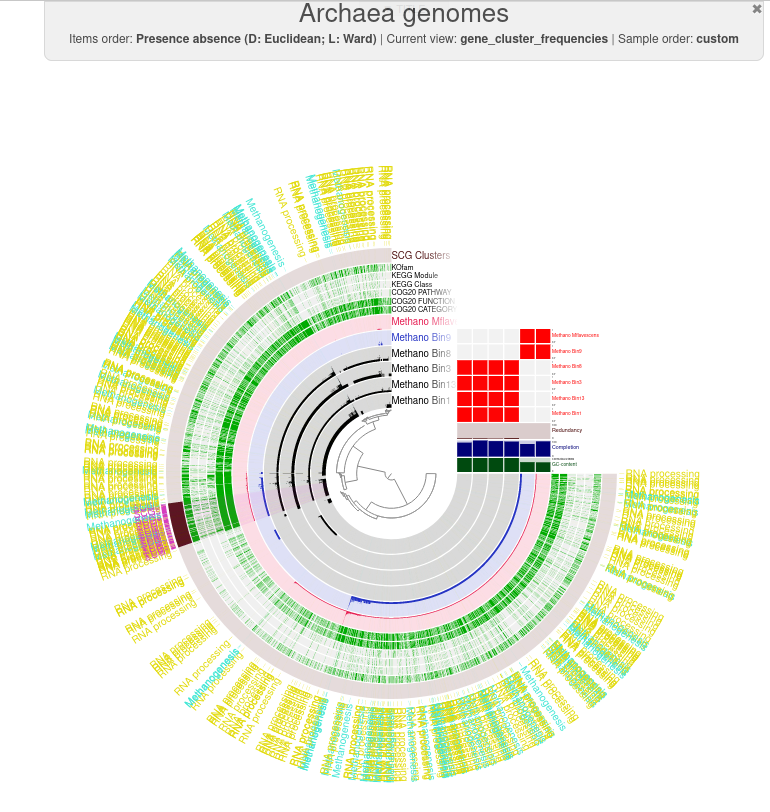
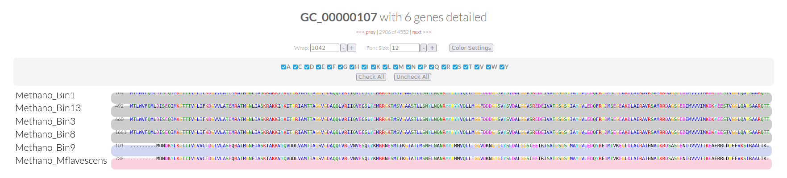

# Day 6

## Pan- and Phylogenomics and databases

have a look at the given data via the anvio visual interface. Therefore setting up a server presenting the data:
```
srun --reservation=biol217 --pty --mem=10G --nodes=1 --tasks-per-node=1 --cpus-per-task=1 /bin/bash

conda activate /home/sunam225/miniconda3/miniconda4.9.2/usr/etc/profile.d/conda.sh/envs/anvio-7.1

anvi-display-contigs-stats *db
```
interface view:



### How do the MAGs compare in size and number of contigs to the full genome?

MAGs have much more contigs. The full genome only has one contig, containing the whole genome. Therefore the size of the one contig is high.


### Based on the contig numbers, sizes and number of marker genes (HMM hits), which two MAGs are the best and which is the worst?

best: 
- Methano_Bin13 has a high total contig length, not too much contigs and the highest number of HHM hits.
- Methano_Bin9 has the second best hit numbers and a slightly higher contig number

worst:
- Methano_Bin5 is the worst, because is has a high number of contigs and a low number of hits
  
generate external genome file:
```
anvi-script-gen-genomes-file --input-dir ../02_contigs-dbs/ -o external-genomes.txt

```
output: 


calculating genome completeness
```
anvi-estimate-genome-completeness -e external-genomes.txt > genome-completeness.txt
```
output: 


### How do the bins compare to isolate genomes? Would you remove one, based on the output of the completeness estimation?

the isolated genome has a high completeness, zero abundancy and a confidence of 1

All bins with a completeness less than 70 % are discarded. Here, that are bin5 and bin10

repeat the creation of the external genome file

```
anvi-script-gen-genomes-file --input-dir ../02_contigs-dbs/ -o external-genomes_final.txt
```
creating the pangenome database:

```
anvi-gen-genomes-storage -e /work_beegfs/sunam229/Day6/03_pangenome/external-genomes_final.txt -o methano_storage-GENOMES.db

anvi-pan-genome -g methano_storage-GENOMES.db --project-name Archaea_genomes --num-threads 10

```

genome similarity calcualtion with ANI using the program pyANI

```anvi-compute-genome-similarity --external-genomes /work_beegfs/sunam229/Day6/03_pangenome/external-genomes_final.txt --program pyANI --output-dir ANI --num-threads 10 --pan-db /work_beegfs/sunam229/Day6/03_pangenome/Archaea_genomes/Archaea_genomes-PAN.db
```

### Scroll to the top of the help and find out which INPUT FILES you need. Write the command and use the additional flag -P. What is the -P flag for?

port number to use for the display

using different ports this time for display:

```
anvi-display-pan -p /work_beegfs/sunam229/Day6/03_pangenome/Archaea_genomes/Archaea_genomes-PAN.db -g /work_beegfs/sunam229/Day6/03_pangenome/methano_storage-GENOMES.db -P 8087

```



## Genome similarity

### Question: Based on the frequency clustering of genes, do you think all genomes are related? Why?

I don't think, that all genomes are related, because the clusters can be separated in two groups not present in all genomes. In Bin9 and M. flavenscens the clusters are similar and in the other ones.

### How does the reference genome compare to its closest bin?

Gene clusters have a similar identity with a few differences and the genomes have the same GC-content

### What ranges are used determine a prokaryotic species? How high can you go until you see changes in ANI? What does the ANI clustering tell you about genome relatedness?

1. the species cut-off is at 95 %
2. 0.98
3. You can see that bin9 and the reference gene are the same species and the rest is related to the reference gene but not the same species

## Functional profiling


### How are Methanogenesis genes distributed across the genome?

They are everywhere on the clusters



highlighting aditionally the RNA processing genes:


## Functional/geometric homogeneity and their uses

### What observations can you make regarding the geometric homogeneity between all genomes and the functional homogeneity?

Only by looking at it the gene has a high geometric and functional homogeneity at the first 4 bins. bin9 and the reference genome lacking a few AAs at the beginning and having therefore a high geometric homogeneity to each other but a sloghly smaller compared to the rest.
The functional homogeneity is high between bin9 and the reference as well.



## BONUS: BlastKoala

### Can the organism do methanogenesis? Does it have genes similar to a bacterial secretion system?

yes and yes