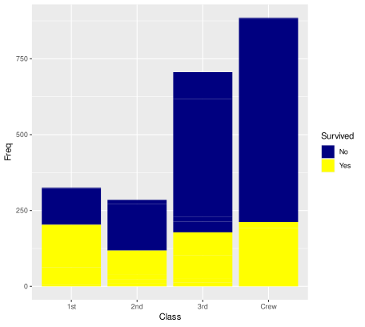
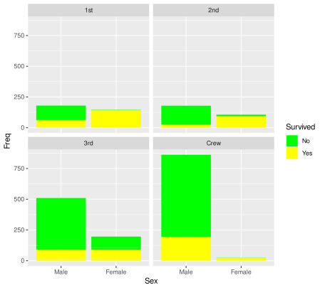

# Day 8

## publication project

doing the project from day 7 again, because it didn't work. There were some program issues

Here the code:

```
reademption create --project_path READemption_analysis --species Methanosarcina='Methanosarcina_mazei'
```
```
wget -O READemption_analysis/input/Methanosarcina_reference_sequences/GCF_000007065.1_ASM706v1_genomic.fna.gz https://ftp.ncbi.nlm.nih.gov/genomes/all/GCF/000/007/065/GCF_000007065.1_ASM706v1/GCF_000007065.1_ASM706v1_genomic.fna.gz
gunzip READemption_analysis/input/Methanosarcina_reference_sequences/GCF_000007065.1_ASM706v1_genomic.fna.gz
mv READemption_analysis/input/Methanosarcina_reference_sequences/GCF_000007065.1_ASM706v1_genomic.fna READemption_analysis/input/Methanosarcina_reference_sequences/GCF_000007065.1_ASM706v1_genomic.fa
#download annotations
wget -P READemption_analysis/input/Methanosarcina_annotations https://ftp.ncbi.nlm.nih.gov/genomes/all/GCF/000/007/065/GCF_000007065.1_ASM706v1/GCF_000007065.1_ASM706v1_genomic.gff.gz
gunzip READemption_analysis/input/Methanosarcina_annotations/GCF_000007065.1_ASM706v1_genomic.gff.gz

# modify header of the sequence file
sed -i "s/>/>NC_003901.1 /" READemption_analysis/input/Methanosarcina_reference_sequences/GCF_000007065.1_ASM706v1_genomic.fa
```


```
source ~/.bashrc

module load miniconda3/4.7.12.1
module load python/3.7.4
conda activate /home/sunam226/.conda/envs/reademption
################################### ---CALCULATIONS---
#aligning:
reademption align --fastq -f READemption_analysis --poly_a_clipping --min_read_length 12 --segemehl_accuracy 95  

# coverage:
reademption coverage -p 4 --project_path READemption_analysis 

#gene wise quanty:
reademption gene_quanti -p 4 --features CDS,tRNA,rRNA --project_path READemption_analysis 

#differential gene expression:
reademption deseq -l sRNA_R1.fa,sRNA_R2.fa,wt_R1.fa,wt_R2.fa -c sRNA,sRNA,wt,wt \
	-r 1,2,1,2 --libs_by_species Methanosarcina=sRNA_R1,sRNA_R2,wt_R1,wt_R2 --project_path READemption_analysis

############################## ---PLOTS---
reademption viz_align --project_path READemption_analysis
reademption viz_gene_quanti --project_path READemption_analysis
reademption viz_deseq --project_path READemption_analysis
conda deactivate
jobinfo
```

## Learning R

- getwd() - t get working directory
- setwd('wantedpath') - set path
- dir.create('foldername') - create directory
- "#" with ------- to  make the code underneath collapsable
- x = "whatever" - define varable
- x <- "whatever" - define variabel (whatever you write on the right side)
- don't use R reserved keywords as variables (list on the internet)
- == - is equal, only one = defines a variable
- != - not equal to

choose the right plot:

andrew abela chart guide
dplyr cheat sheet

plotting:

```
ggplot(data.frame(Titanic), mapping=aes(x=Sex, y=Freq, fill=Survived)) + geom_col()+ scale_fill_manual(values = alpha(c("navy", "yellow")))
```

have a wider repository selection:

```
setRepositories()

```

made these plots:





