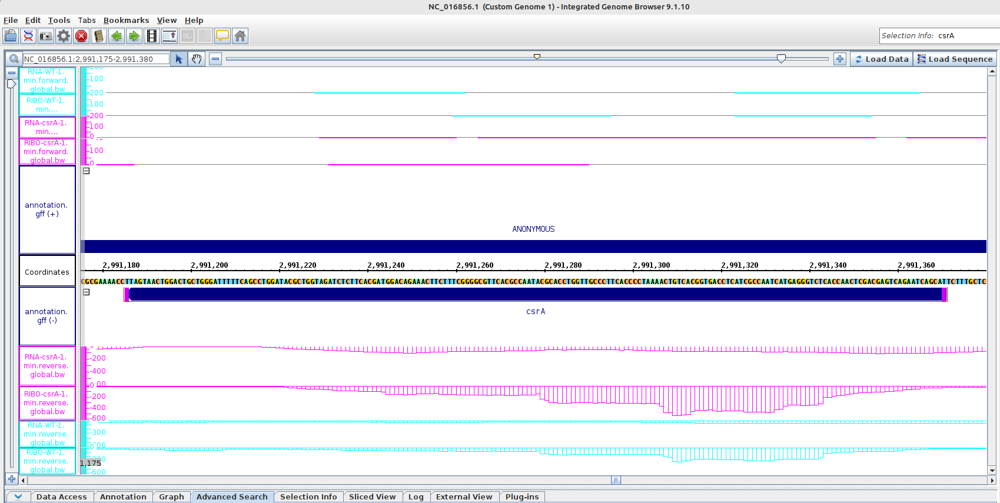
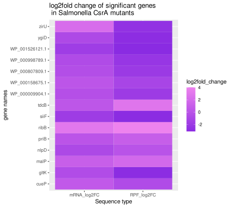
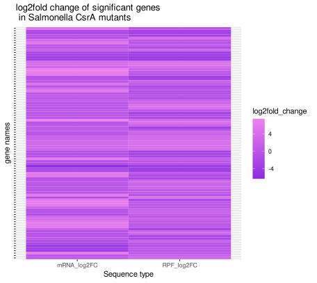

# Day 9
## RNA-seq and Ribo-seq

RNA-seq -> transcriptome

ribo-seq -> translatome

### h ribo pipeline

https://hribo.readthedocs.io/en/latest/?badge=latest


## Working with Integrated Genome Browser (IGB)

### Task 1: Find the ORF encoding csrA and some of its features

1. start codon: ATG (reverse strand)
2. stop codon: TAA
3. length in amino acids: 62 (61 without stop)
4. SD: AGGAG at -7 -> Shine-Dalgarno sequence
5. name of upstream gene: STM14_3413
6. is it translated? why?: Yes, because of ribosome expression graph peaks
   


### looking for genes with an expression difference between mutant and wildtype

in the excel sheet look for padj values smaller than 0.05, so the differnce is significant and searching the genes in IGB. A difference in expression can be observed

### creating a heat map in R

```
library(readxl)
df <- read_excel("csrA-WT_sorted.xlsx", sheet = "Sheet4")
View(df)

library(ggplot2)

ggplot(data=df, aes(x=seq_type, y= name, fill=log2fold_change)) + geom_tile() + scale_fill_gradient(low = "blueviolet",high = "violet",guide = "colorbar") + 
  labs(title = "log2fold change of significant genes \n in Salmonella CsrA mutants", x = "Sequence type", y = "gene names")

```


bigger one:

```
ggplot(data=df_big, aes(x=seq_type, y= identifier, fill=log2fold_change)) + geom_tile() + scale_fill_gradient(low = "blueviolet",high = "violet",guide = "colorbar") + 
  labs(title = "log2fold change of significant genes \n in Salmonella CsrA mutants", x = "Sequence type", y = "gene names") + 
  theme(axis.text.y=element_blank())

```



- plotly for 3D plots
  